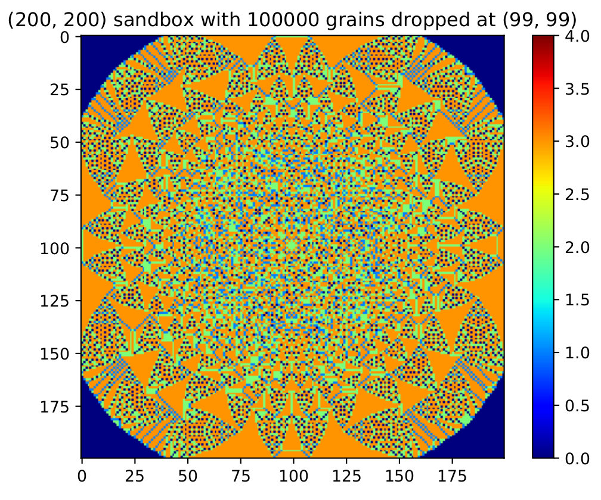

Simulation of the dynamics of sandpiles via cellular automata
=============================================================

Implementation of the Bak-Tang-Wiesenfeld approach of cellular automata for sandpile dynamics.
Additional implementation of a customized model. The simulations store the characteristic statistics of the sandpile dynamics such as

- Avalanche duration (equivalent to number of iterations/recursions)
- Avalanche size (equivalent to amount of topplings during avalanche)
- Avalanche area (equivalent to number of lattice sites participating in avalanche)
- Avalanche's linear size (equivalent to maximum distance in between two sites in an avalanche)

In general (depending on memory recources etc.), the implemetations work for arbitrary dimensions. 

Usage
*****

The simulation of the Bak-Tang-Wiesenfeld implementation is started with its default parameters by running

.. code-block:: bash
   
   python sandpile_btw.py

Optionally, the simulation parameters can be loaded from a setup file like

.. code-block:: bash

   python sandpile_btw.py --setup example_setup.yaml

Take a look in the `example_setup.yaml` in the example folder. You can also take a look into the script itself and start simulation from within.
The code is rather well-commented so you should be able to easily modify the code to suite your needs.

Required packages
*****************

The following packages are required for the simulation:

.. code-block:: bash

   numpy numba scipy matplotlib

For plotting the (live) evolution of the sandpiles and loading the simulation setup from a file, these additional packages are required:

.. code-block:: bash

   pyqtgraph pyyaml

Examples
********

.. image:: _static/f2.png
   :width: 49 %
.. image:: _static/f3.png
   :width: 49 %
